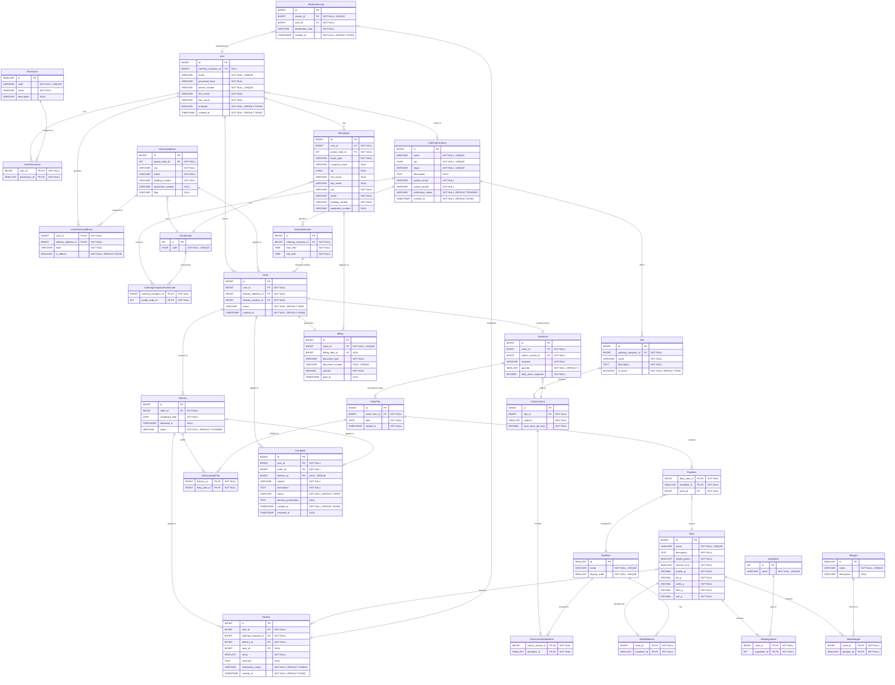

```mermaid
erDiagram
    User {
        BIGINT id PK
        BIGINT catering_company_id FK "NULL"
        VARCHAR email "NOT NULL, UNIQUE"
        VARCHAR password_hash "NOT NULL"
        VARCHAR phone_number "NOT NULL, UNIQUE"
        VARCHAR first_name "NOT NULL"
        VARCHAR last_name "NOT NULL"
        BOOLEAN archived "NOT NULL, DEFAULT FALSE"
        TIMESTAMP created_at "NOT NULL, DEFAULT NOW()"
    }

    Permission {
        SMALLINT id PK
        VARCHAR code "NOT NULL, UNIQUE"
        VARCHAR name "NOT NULL"
        VARCHAR description "NULL"
    }

    UserPermission {
        BIGINT user_id PK, FK "NOT NULL"
        SMALLINT permission_id PK, FK "NOT NULL"
    }

    DeliveryAddress {
        BIGINT id PK
        INT postal_code_id FK "NOT NULL"
        VARCHAR city "NOT NULL"
        VARCHAR street "NOT NULL"
        VARCHAR building_number "NOT NULL"
        VARCHAR apartment_number "NULL"
        VARCHAR floor "NULL"
    }

    UserDeliveryAddress {
        BIGINT user_id PK, FK "NOT NULL"
        BIGINT delivery_address_id PK, FK "NOT NULL"
        VARCHAR label "NOT NULL"
        BOOLEAN is_default "NOT NULL, DEFAULT FALSE"
    }

    BillingData {
        BIGINT id PK
        BIGINT user_id FK "NOT NULL"
        INT postal_code_id FK "NOT NULL"
        VARCHAR buyer_type "NOT NULL"
        VARCHAR company_name "NULL"
        CHAR nip "NULL"
        VARCHAR first_name "NULL"
        VARCHAR last_name "NULL"
        VARCHAR city "NOT NULL"
        VARCHAR street "NOT NULL"
        VARCHAR building_number "NOT NULL"
        VARCHAR apartment_number "NULL"
    }

    CateringCompany {
        BIGINT id PK
        VARCHAR name "NOT NULL, UNIQUE"
        CHAR nip "NOT NULL, UNIQUE"
        VARCHAR regon "NOT NULL, UNIQUE"
        TEXT description "NULL"
        VARCHAR contact_email "NOT NULL"
        VARCHAR contact_phone "NOT NULL"
        VARCHAR verification_status "NOT NULL, DEFAULT 'PENDING'"
        TIMESTAMP created_at "NOT NULL, DEFAULT NOW()"
    }

    PostalCode {
        INT id PK
        CHAR code "NOT NULL, UNIQUE"
    }

    CateringCompanyPostalCode {
        BIGINT catering_company_id PK, FK "NOT NULL"
        INT postal_code_id PK, FK "NOT NULL"
    }

    DeliveryWindow {
        BIGINT id PK
        BIGINT catering_company_id FK "NOT NULL"
        TIME start_time "NOT NULL"
        TIME end_time "NOT NULL"
    }

    Diet {
        BIGINT id PK
        BIGINT catering_company_id FK "NOT NULL"
        VARCHAR name "NOT NULL"
        TEXT description "NOT NULL"
        BOOLEAN is_active "NOT NULL, DEFAULT TRUE"
    }

    CaloricVariant {
        BIGINT id PK
        BIGINT diet_id FK "NOT NULL"
        SMALLINT calories "NOT NULL"
        DECIMAL base_price_per_day "NOT NULL"
    }

    Mealtime {
        SMALLINT id PK
        VARCHAR name "NOT NULL, UNIQUE"
        SMALLINT display_order "NOT NULL, UNIQUE"
    }

    CaloricVariantMealtime {
        BIGINT caloric_variant_id PK, FK "NOT NULL"
        SMALLINT mealtime_id PK, FK "NOT NULL"
    }

    Meal {
        BIGINT id PK
        VARCHAR name "NOT NULL, UNIQUE"
        TEXT description "NOT NULL"
        SMALLINT weight_grams "NOT NULL"
        SMALLINT calories_kcal "NOT NULL"
        DECIMAL protein_g "NOT NULL"
        DECIMAL fat_g "NOT NULL"
        DECIMAL carbs_g "NOT NULL"
        DECIMAL fiber_g "NOT NULL"
        DECIMAL salt_g "NOT NULL"
    }

    MealMealtime {
        BIGINT meal_id PK, FK "NOT NULL"
        SMALLINT mealtime_id PK, FK "NOT NULL"
    }

    Ingredient {
        INT id PK
        VARCHAR name "NOT NULL, UNIQUE"
    }

    MealIngredient {
        BIGINT meal_id PK, FK "NOT NULL"
        INT ingredient_id PK, FK "NOT NULL"
    }

    Allergen {
        SMALLINT id PK
        VARCHAR name "NOT NULL, UNIQUE"
        VARCHAR description "NULL"
    }

    MealAllergen {
        BIGINT meal_id PK, FK "NOT NULL"
        SMALLINT allergen_id PK, FK "NOT NULL"
    }

    Order {
        BIGINT id PK
        BIGINT user_id FK "NOT NULL"
        BIGINT delivery_address_id FK "NOT NULL"
        BIGINT delivery_window_id FK "NOT NULL"
        VARCHAR status "NOT NULL, DEFAULT 'NEW'"
        TIMESTAMP created_at "NOT NULL, DEFAULT NOW()"
    }

    OrderItem {
        BIGINT id PK
        BIGINT order_id FK "NOT NULL"
        BIGINT caloric_variant_id FK "NOT NULL"
        VARCHAR recipient "NOT NULL"
        SMALLINT quantity "NOT NULL, DEFAULT 1"
        DECIMAL daily_price_snapshot "NOT NULL"
    }

    DailyPlan {
        BIGINT id PK
        BIGINT order_item_id FK "NOT NULL"
        DATE date "NOT NULL"
        TIMESTAMP locked_at "NOT NULL"
    }

    PlanItem {
        BIGINT daily_plan_id PK, FK "NOT NULL"
        SMALLINT mealtime_id PK, FK "NOT NULL"
        BIGINT meal_id FK "NOT NULL"
    }

    Delivery {
        BIGINT id PK
        BIGINT order_id FK "NOT NULL"
        DATE scheduled_date "NOT NULL"
        TIMESTAMP delivered_at "NULL"
        VARCHAR status "NOT NULL, DEFAULT 'PLANNED'"
    }

    DeliveryDailyPlan {
        BIGINT delivery_id PK, FK "NOT NULL"
        BIGINT daily_plan_id PK, FK "NOT NULL"
    }

    Billing {
        BIGINT id PK
        BIGINT order_id FK "NOT NULL, UNIQUE"
        BIGINT billing_data_id FK "NULL"
        VARCHAR document_type "NOT NULL"
        VARCHAR document_number "NULL, UNIQUE"
        DECIMAL amount "NOT NULL"
        TIMESTAMP paid_at "NULL"
    }

    Review {
        BIGINT id PK
        BIGINT user_id FK "NOT NULL"
        BIGINT catering_company_id FK "NOT NULL"
        BIGINT delivery_id FK "NOT NULL"
        BIGINT meal_id FK "NULL"
        SMALLINT rating "NOT NULL"
        TEXT comment "NULL"
        VARCHAR moderation_status "NOT NULL, DEFAULT 'VISIBLE'"
        TIMESTAMP created_at "NOT NULL, DEFAULT NOW()"
    }

    ModerationLog {
        BIGINT id PK
        BIGINT review_id FK "NOT NULL, UNIQUE"
        BIGINT user_id FK "NOT NULL"
        VARCHAR moderation_note "NOT NULL"
        TIMESTAMP created_at "NOT NULL, DEFAULT NOW()"
    }

    Complaint {
        BIGINT id PK
        BIGINT user_id FK "NOT NULL"
        BIGINT order_id FK "NOT NULL"
        BIGINT delivery_id FK "NULL, UNIQUE"
        VARCHAR subject "NOT NULL"
        TEXT description "NOT NULL"
        VARCHAR status "NOT NULL, DEFAULT 'OPEN'"
        TEXT decision_justification "NULL"
        TIMESTAMP created_at "NOT NULL, DEFAULT NOW()"
        TIMESTAMP resolved_at "NULL"
    }

    %% Relacje dla encji asocjacyjnych (rozbicie N:M)
    User ||--o{ UserPermission : "has"
    Permission ||--o{ UserPermission : "assigned to"

    User ||--o{ UserDeliveryAddress : "specifies"
    DeliveryAddress ||--o{ UserDeliveryAddress : "assigned to"

    CateringCompany ||--o{ CateringCompanyPostalCode : "services"
    PostalCode ||--o{ CateringCompanyPostalCode : "serviced by"

    CaloricVariant ||--|{ CaloricVariantMealtime : "includes"
    Mealtime ||--o{ CaloricVariantMealtime : "included in"

    Meal ||--|{ MealMealtime : "intended for"
    Mealtime ||--o{ MealMealtime : "has"

    Meal ||--|{ MealIngredient : "contains"
    Ingredient ||--o{ MealIngredient : "part of"

    Meal ||--o{ MealAllergen : "contains"
    Allergen ||--o{ MealAllergen : "present in"

    Delivery ||--|{ DeliveryDailyPlan : "fulfills"
    DailyPlan ||--o{ DeliveryDailyPlan : "fulfilled by"

    %% Pozostałe relacje 1:N oraz 1:1
    User ||--o{ BillingData : "has"
    User ||--o{ Order : "places"
    User }o--o| CateringCompany : "works at"

    CateringCompany ||--o{ Diet : "offers"
    CateringCompany ||--o{ DeliveryWindow : "specifies"

    Diet ||--o{ CaloricVariant : "contains"

    OrderItem }o--|| CaloricVariant : "selects"
    OrderItem ||--|{ DailyPlan : "has delivery days"

    DailyPlan ||--|{ PlanItem : "contains"
    PlanItem }o--|| Mealtime : "assigned to"
    PlanItem }o--|| Meal : "serves"

    DeliveryAddress ||--o{ Order : "applies to"
    DeliveryAddress }o--|| PostalCode : "has"
    BillingData }o--|| PostalCode : "has"
    DeliveryWindow ||--o{ Order : "selected window"

    Order ||--|{ OrderItem : "contains items"
    Order ||--|| Billing : "generates"
    Order ||--|{ Delivery : "consists of"
    Order ||--o{ Complaint : "applies to"

    BillingData |o--o{ Billing : "appears on"

    Delivery |o--o| Complaint : "applies to"
    Delivery ||--o{ Review : "applies to"
    Meal |o--o{ Review : "receives"

    ModerationLog |o--|| Review : "moderates"
    ModerationLog }o--|| User : "moderated by"
```