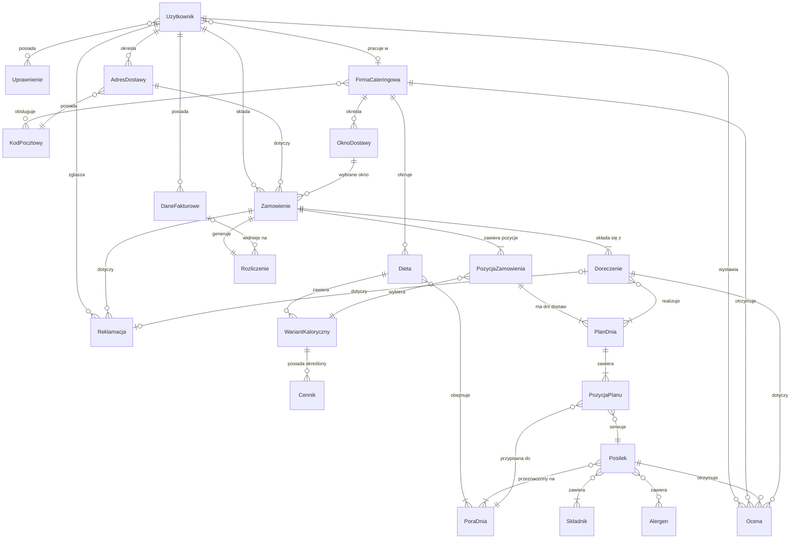

# Diagram ERD - Agregator diet pudełkowych

## Diagram Mermaid

## Uwagi do modelu

* `PozycjaZamowienia` reprezentuje jedną pozycję zamówienia, czyli dietę jednego domownika w ramach zamówienia. Atrybuty: `domownik` (etykieta, np. „Tata"), opcjonalnie `ilosc` (gdy kilka osób bierze ten sam wariant i te same dni).

* `PlanDnia` to konkretny plan dnia z atrybutem `data` (dni wybrane przez danego domownika). Fizyczne doręczenie (`Doreczenie`) może realizować wiele planów z różnych dni i różnych domowników.

* „Dokładnie jeden posiłek na porę dnia" wymusza unikalność pary (PlanDnia, PoraDnia) w `PozycjaPlanu` — niewyrażalne w diagramie ERD.

