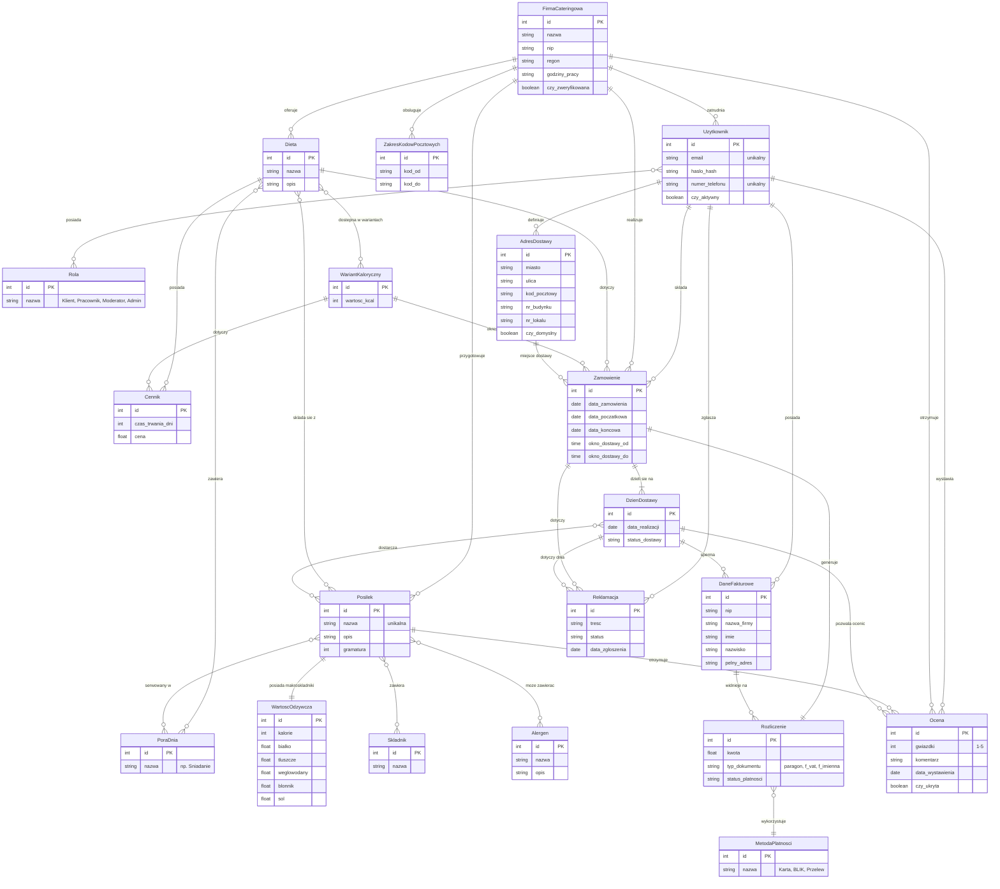

# Diagram ERD - Agregator diet pudełkowych

Poniżej znajduje się diagram obiektowo-związkowy (ERD) dla systemu agregatora diet pudełkowych, zaprojektowany na podstawie pliku `README.md` oraz zgodnie z wytycznymi.

## Założenia zrealizowane na diagramie:
1. **Brak encji asocjacyjnych**: Zgodnie z poleceniem, relacje wiele-do-wielu (N:N) zostały zamodelowane bezpośrednio (np. `Posilek }o--o{ Skladnik`), bez tworzenia pośrednich, asocjacyjnych encji łączących.
2. **Liczba encji**: Diagram zawiera równo 20 unikalnych encji bazodanowych pokrywających pełen zakres logiki systemu z dokumentacji.
3. **Relacje**: W modelu prawidłowo uwzględniono zróżnicowane typy relacji (1:1, 1:N oraz N:N).

## Diagram Mermaid

