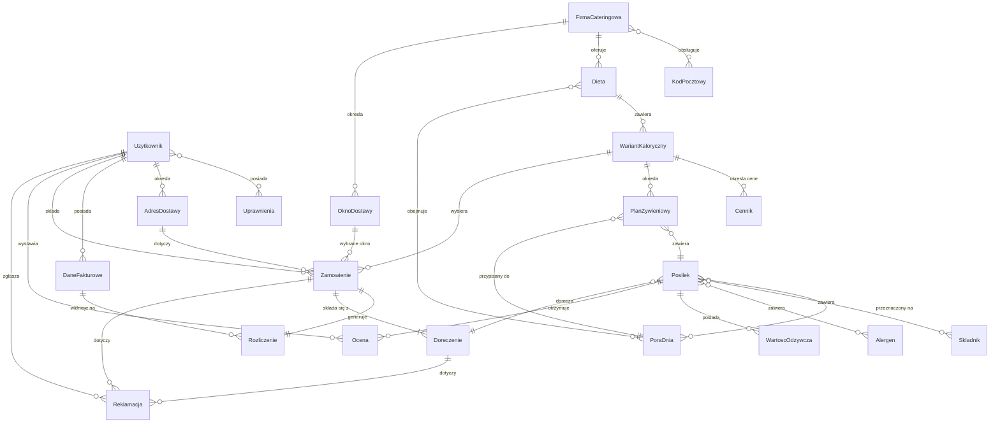

# Diagram ERD - Agregator diet pudełkowych

## Diagram Mermaid

```mermaid
erDiagram
    Uzytkownik }o--o{ Uprawnienia : "posiada"
    Uzytkownik ||--o{ AdresDostawy : "okresla"
    Uzytkownik ||--o{ DaneFakturowe : "posiada"
    Uzytkownik ||--o{ Zamowienie : "sklada"
    Uzytkownik ||--o{ Ocena : "wystawia"
    Uzytkownik ||--o{ Reklamacja : "zglasza"

    FirmaCateringowa }o--o{ KodPocztowy : "obsluguje"
    FirmaCateringowa ||--o{ Dieta : "oferuje"
    FirmaCateringowa ||--o{ OknoDostawy : "okresla"

    Dieta ||--o{ WariantKaloryczny : "zawiera"
    Dieta }o--o{ PoraDnia : "obejmuje"
    
    WariantKaloryczny ||--o{ Cennik : "okresla cene"
    WariantKaloryczny ||--o{ PlanZywieniowy : "okresla"
    WariantKaloryczny ||--o{ Zamowienie : "wybiera"

    Posilek }o--o{ PoraDnia : "przeznaczony na"
    Posilek }o--o{ Skladnik : "zawiera"
    Posilek }o--o{ Alergen : "zawiera"
    Posilek ||--o{ WartoscOdzywcza : "posiada"
    Posilek ||--o{ Ocena : "otrzymuje"

    PlanZywieniowy }o--|| Posilek : "zawiera"
    PlanZywieniowy }o--|| PoraDnia : "przypisany do"

    AdresDostawy ||--o{ Zamowienie : "dotyczy"
    OknoDostawy ||--o{ Zamowienie : "wybrane okno"

    Zamowienie ||--|| Rozliczenie : "generuje"
    Zamowienie ||--|{ Doreczenie : "składa się z"
    Zamowienie ||--o{ Reklamacja : "dotyczy"

    DaneFakturowe ||--o{ Rozliczenie : "widnieje na"

    Posilek }o--|| Doreczenie : "dorecza"
    Doreczenie ||--o{ Reklamacja : "dotyczy"
```

